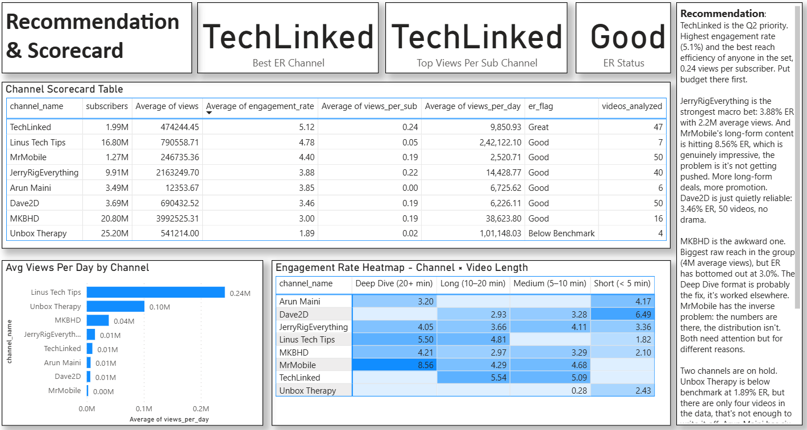

# HardScope Creator Program Measurement Workspace

### YouTube Tech Reviewer Analysis

**Stack:** Python · YouTube Data API v3 · Pandas · Power BI

Submission for **HardScope — Lead Analyst, Creator Strategy & ROI Measurement Challenge**

---

# Program Context

This project evaluates the performance of a **technology creator marketing program** using public YouTube performance data.

The partnerships team needs answers to three questions:

1. What did we actually get from this creator program?
2. Which creators and formats are working?
3. Where should we allocate creator budget next quarter?

To answer those questions, this workspace builds a lightweight measurement system: pull real data from the YouTube API, clean and model it in Python, and report through a 4-page Power BI dashboard.

---

## Data Pipeline Architecture

YouTube Data API → Python Data Pipeline → Analytics Dataset → Power BI Dashboard → Marketing Insights

---

# Data Source

All data was collected from the **YouTube Data API v3**.

The API returns public performance metrics for creators and videos without requiring channel authorization.

Endpoints used:

| Endpoint | Data Returned | API Units Used |
|----------|--------------|----------------|
| channels.list | subscriber counts and channel metadata | ~8 units (1 per channel) |
| search.list | recent videos per creator | ~800 units (100 per channel) |
| videos.list | views, likes, comments, duration | ~5 units (batch calls) |

**Total API units used: ~813 out of 10,000 free daily quota.**
No billing required. Free tier is sufficient for the full pipeline.

Dataset summary:

* 8 tech creators
* 220 videos
* 227M total views

Creators analyzed include:

MKBHD
Linus Tech Tips
JerryRigEverything
Unbox Therapy
Dave2D
TechLinked
Arun Maini
MrMobile

---

# Measurement Framework

The measurement system is built around a **three-layer creator marketing funnel**.

## Awareness

Measures reach and audience exposure.

Metrics:

Views
Subscribers
Average views per video

---

## Engagement

Measures audience interaction and attention.

Metrics:

Engagement rate
Like rate
Comment rate

Formulas:

```
Engagement Rate = (likes + comments) / views × 100
Like Rate       = likes / views × 100
Comment Rate    = comments / views × 100
```

---

## Consideration (Intent Proxy)

Direct purchase signals are not available via the public YouTube API.

Intent is approximated using behavioral proxies.

Metrics:

Views per subscriber
Views per day
Comment rate

These metrics indicate deeper audience interest beyond passive viewing.

---

# Benchmark Thresholds

What counts as "good" vs "bad" — sourced from Influencer Marketing Hub 2024 YouTube Benchmark Report and CreatorIQ 2024 State of Creator Marketing.

| Metric | Below Benchmark | Good | Great | Source |
|--------|----------------|------|-------|--------|
| Engagement Rate | < 3.0% | 3.0–5.0% | > 5.0% | Influencer Marketing Hub 2024 |
| Like Rate | < 2.0% | 2.0–4.0% | > 4.0% | CreatorIQ 2024 |
| Comment Rate | < 0.05% | 0.05–0.15% | > 0.15% | CreatorIQ 2024 |
| Views Per Subscriber | < 0.10 | 0.10–0.30 | > 0.30 | Internal benchmark |

---

# Creator Marketing Funnel

Program-level funnel:

Views (Awareness)
227M

Engagements
8M → **3.36% engagement rate**

Comments
~0.22% comment rate

The funnel visual highlights where audience interaction drops across the creator program.

---

# Engineered Analytics Features

The dataset includes engineered metrics derived during data transformation.

| Feature          | Description                   |
| ---------------- | ----------------------------- |
| engagement_rate  | (likes + comments) / views    |
| like_rate        | likes / views                 |
| comment_rate     | comments / views              |
| views_per_sub    | reach efficiency              |
| views_per_day    | recency-adjusted performance  |
| duration_bucket  | video length category         |
| performance_tier | top / mid / bottom performers |

Two analytics tables are produced:

videos (video-level dataset)
channel_summary (creator rollup)

---

# Dashboard Overview

The Power BI dashboard contains four pages designed for marketing stakeholders.

---

## Program Overview

High-level creator program performance.

Includes:

program KPI cards
creator marketing funnel
engagement benchmark comparison
views by creator
video distribution

Purpose: assess overall program health.

---

## Video Performance Deep Dive

Analyzes creator performance and identifies scaling opportunities.

Key visual:

**Creator Performance Matrix**

Axes:

Views (reach)
Engagement rate (quality)

Quadrant interpretation:

High reach + high engagement → scale creator
High reach + low engagement → optimize content
Low reach + high engagement → promote distribution
Low reach + low engagement → reduce investment

---

## Format & Engagement Analysis

Evaluates the impact of video format.

Insights:

Long-form videos (>20 min) generate the highest engagement and highest average views.

Short videos (<5 min) consistently underperform.

Visuals include:

engagement by video length
views by format
performance tier distribution
creator × format heatmap

---

## Recommendations & Creator Scorecard

Final decision layer.

Includes:

creator scorecard table
engagement heatmap
views per day analysis
written strategic recommendations

---

# Key Findings

1. TechLinked shows the strongest engagement efficiency (5.12% ER and 0.24 views per subscriber).

2. Long-form videos consistently outperform shorter formats across both engagement and views.

3. MrMobile produces highly engaging long-form content but requires stronger distribution.

4. MKBHD delivers the largest reach but engagement sits near the benchmark threshold.

5. Short videos underperform across most creators.

---

# Limitations

Public platform data introduces several limitations.

| Limitation                         | Impact                       |
| ---------------------------------- | ---------------------------- |
| No watch-time data                 | cannot measure retention     |
| No click-through data              | conversion layer not visible |
| No branded search signal           | discovery intent unknown     |
| Low video counts for some channels | averages less reliable       |

These limitations are documented transparently rather than hidden.

---

# Architecture Decisions

Python was used for:

data ingestion
feature engineering
dataset modeling

Power BI was used for:

interactive dashboards
creator comparison
decision-oriented reporting

This approach separates data engineering from visualization while keeping the workflow reproducible.

---

# Running the Project

Install dependencies:

```
pip install requests pandas openpyxl python-dotenv
```

Create a `.env` file:

```
YOUTUBE_API_KEY=your_api_key
```

Run pipeline:

```
jupyter notebook creator_data_pipeline.ipynb
```

Run all cells top to bottom. The notebook covers channel fetch, video fetch, cleaning, feature engineering, and Excel export in sequence.

Open Power BI dashboard:

```
File → Open → HardScope_Dashboard.pbix
```

Or load the raw data manually:

```
Power BI → Get Data → Excel → hardscope_output/yt_tech_reviewers.xlsx
Load all 3 sheets: videos, channel_summary, benchmarks
```

---

# What I'd Do With Another Week

1. **Paginate the API pull** — use `nextPageToken` to get 200+ videos per channel instead of 50. Unbox Therapy (4 videos) and Arun Maini (6 videos) have unreliable averages right now.

2. **Add Google Trends API** — pull branded search interest index to add a real consideration-layer signal. Currently proxied by views_per_sub and views_per_day; search lift would be more defensible.

3. **Connect GA4 or Shopify data** — integrate UTM-tagged description link data to close the loop from engagement to site visits and purchases. That turns engagement rate into actual ROAS.

4. **Add comment sentiment NLP** — classify comments as positive/neutral/negative per creator using a lightweight model. Comment count is a signal; comment tone is a stronger one.

5. **Automate weekly refresh** — schedule the Python notebook to pull the latest 50 videos per channel weekly, overwrite the Excel file, and trigger a Power BI dataset refresh automatically.

6. **Expand to a second platform** — normalize TikTok or Instagram metrics into the same schema for cross-platform creator comparison.

---

Built for **HardScope — Lead Analyst Creator Strategy & ROI Measurement Challenge**